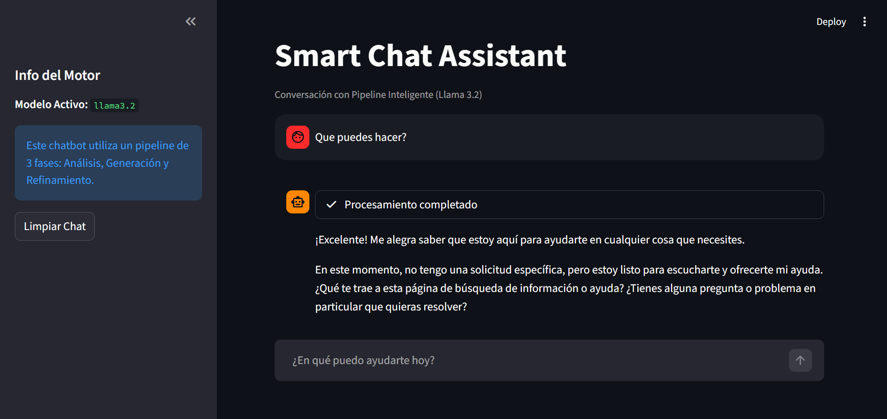
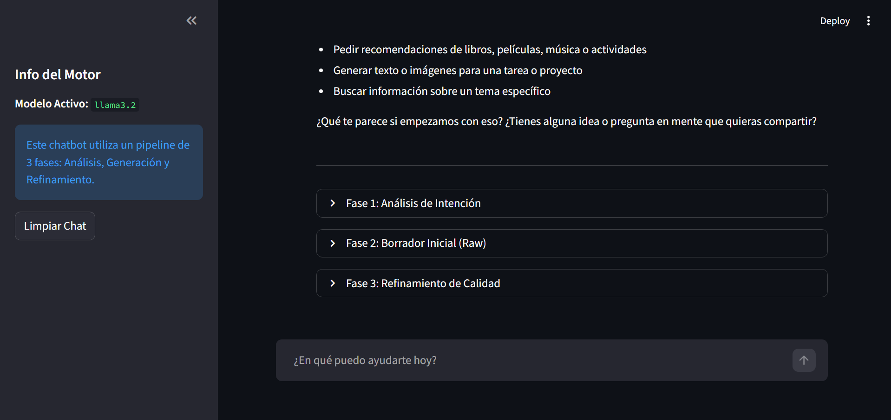

# Development Report: Smart Chat Assistant (Lab_Exercises_3)
**Developed by: Sergio Arca Montenegro**

This document details the design, implementation, and optimization process of the application developed for Laboratory Exercise 3 of the **Natural Language Processing** course.

## 1. Project Objective
The main goal was to build a complete natural language processing system using a locally hosted Large Language Model (LLM). The application goes beyond basic "question-answer" interactions through an advanced reasoning and automatic refinement pipeline.

## 2. Technical Decisions and Optimization

### Local Model Selection
**Llama 3.2 (3B)** was selected as the core engine:
- **Optimization**: This 2GB model was prioritized over larger 14B models to ensure minimal latency and smooth execution on local hardware.
- **Performance**: It allows for multiple processing passes (analysis, drafting, and refinement) within seconds.

### Application Architecture
- **Interface**: Developed with **Streamlit**, featuring a dark aesthetic and native chat components.
- **Backend**: Direct communication with the Ollama API via HTTP streaming.

## 3. Reasoning Pipeline (Added Value)

The application implements a processing hierarchy that separates "thinking" from the "final response":

### Internal Thinking and Analysis Phase
When a user sends a query, the system activates an internal process visible via a loading state ("Pensando y Analizando..."):
1.  **Intent Analysis**: The model identifies the best strategy for responding.
2.  **Internal Draft**: A first version of the response is generated based on the conversation history. This draft is kept internal to avoid visual noise.

### Smart Final Response (Refinement)
Once the internal thinking is complete, the system executes a **Refinement Phase**. The model takes the previous draft and polishes it to improve clarity, structure, and technical accuracy. This refined version is what is shown in the chat and stored in the assistant's memory.

## 4. Memory Management and UX
- **Persistent Context**: `st.session_state` is used to maintain the conversation thread, storing only the refined versions of the responses to maintain context quality.
- **High-Quality Streaming**: Users see the final response being written in real-time, providing a natural interactive feel.

## 5. Video Demonstration
You can watch a full demonstration of the application, including the 3-phase pipeline and the user interface, by following this link:
[Watch the Demonstration Video](https://drive.google.com/file/d/1oTFvFz0KDtoQXlAgy2kmM3DqKo7xeA4p/view?usp=sharing)

## 6. Conclusion
This laboratory demonstrates how post-processing (refinement) can transform a generic response into an expert, well-structured solution, enhancing the quality of human-machine interaction without the need for massive, heavy models.
